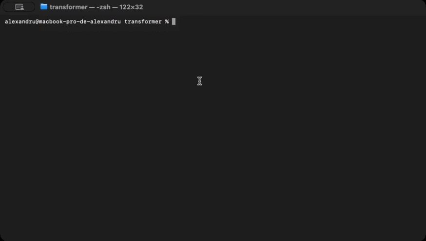
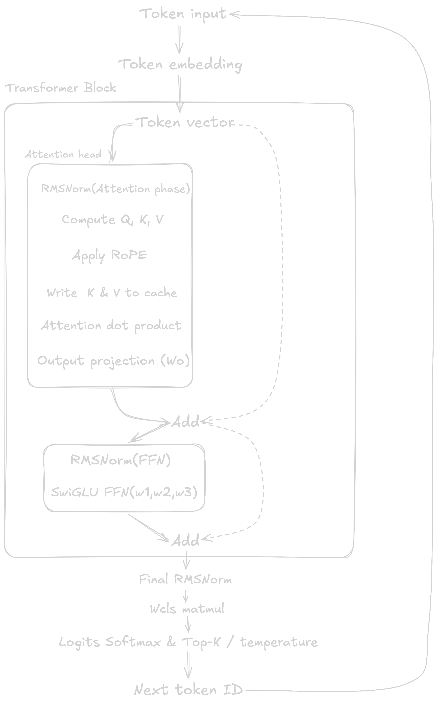

## C++ Transformer inference engine


A high-performance, zero-dependency LLaMA-style Transformer inference engine implemented from scratch in pure C++17.

<p align="center">
  
</p>

## Key Features

  * **Architecture:** Full implementation of the modern LLaMA pipeline:
    * **RMSNorm:** Pre-normalization for numerical stability.
    * **RoPE (Rotary Position Embeddings):** Frequency-based positional encodings on query/key states.
    * **GQA (Grouped Query Attention):** Arbitrary head-to-KV head mapping support.
    * **SwiGLU Activation:** Gated feed-forward network ($x \cdot \text{SiLU}(W_1 x) \cdot W_3 x$).
* **Persistent KV Caching:** Eliminates redundant forward passes over prior context, preserving attention states across inference steps.
* **Optimized Top-K Temperature Sampler:** Uses `std::partial_sort` over vocabulary indices to achieve $\mathcal{O}(N \log K)$ selection without allocating full mapping structures per step.
* **Multi-Threaded Acceleration:** Parallelized matrix-vector multiplication via OpenMP across all available physical and efficiency cores.
* **Zero-Copy Weight Loading:** Replaced standard file stream reading with POSIX mmap, mapping model weights directly into virtual memory for nearly instant startup times.
* **Single-Unit Portability:** Built as a standalone binary with zero external dependencies beyond standard libc/libomp.
---
## Architecture
<p align="center">
  
</p>


## Performance Benchmark

Benchmarked on **Apple M5** using the **Stories-110M** checkpoint in full single-precision float (`FP32`):

| Configuration | Parameters | Precision | Memory Bandwidth (Est.) | Throughput |
| :--- | :--- | :--- | :--- | :--- |
| Single-Threaded | 110M | FP32 | ~10.3 GB/s | ~23.5 tok/s |
| **OpenMP** Parallel | **110M** | **FP32** | **~30.8 GB/s** | **~68–70 tok/s** |


## Build & Run
### 1. Prerequisites
- Clang / GCC supporting C++17
- OpenMP (brew install libomp llvm on macOS)
### 2. Download Model & Tokenizer
```Bash
# 1. Download the tokenizer binary
curl -O https://github.com/karpathy/llama2.c/raw/master/tokenizer.bin

# 2. Download the Stories-110M model weights (440 MB)
curl -L -O https://huggingface.co/karpathy/tinyllamas/resolve/main/stories110M.bin
```
## Compilation
macOS (Apple Silicon via Homebrew):

```Bash
clang++ -O3 -std=c++17 -Xpreprocessor -fopenmp \
    -I/opt/homebrew/opt/libomp/include \
    -L/opt/homebrew/opt/libomp/lib \
    -lomp \
    main.cpp -o main
```
Linux (GCC):
```Bash
g++ -O3 -std=c++17 -fopenmp main.cpp -o main
```
## Execution
```bash
./main
```

## References
- Touvron et al., LLaMA: Open and Efficient Foundation Language Models (2023)
- Andrej Karpathy, llama2.c (Minimalist C inference reference)